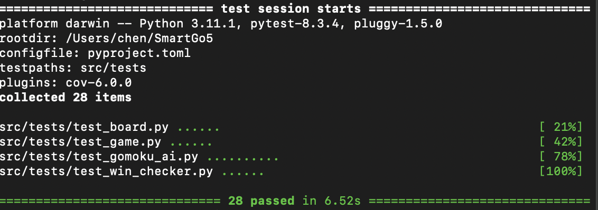

## Yksikkötestit
1. test_board.py tarkastaa laudan alustuksen tilan. Se tarkistaa, onko siirtojen suorittaminen tehokasta, onko nappuloita asetettu laudan ulkopuolelle, onko jo varattuun paikkaan asetettu nappuloita uudelleen. Sitten se tarkastaa, päivittyykö käytettävissä olevien siirtojen joukko oikein. Sekä tarkastaa, onko sillä kyky suorittaa useita peräkkäisiä toimivia siirtoja. Testauksessa käytettiin erilaisia koordinaatteja syötteinä, mukaan lukien kelvollisia koordinaatteja (kuten (3, 4), (10, 10)), epäkelpoja rajojen ulkopuolisia koordinaatteja (kuten (-1, 0), (20, 0)) ja laudan reunakoordinaatteja (kuten (0, 0), (19, 19)). Testi vahvisti myös erilaisten nappulamerkintöjen ('X' ja 'O') käytön, tarkistaen niiden oikean sijoituksen ja esityksen laudalla.

2. test_game.py tarkastaa ensin pelin alustuksen tilan, vahvistaen että pelaaja 'X' on asetettu oikein ensimmäiseksi pelaajaksi pelin alkaessa, ja että tekoäly vastustaja on alustettu. Toiseksi, se testaa pelaajien vuorojärjestystä, vahvistaen että ihmispelaajan nappulan asettamisen jälkeen pelin tila ja nykyinen pelaaja päivittyvät oikein. Testi sisältää myös voiton tunnistustoiminnon, tarkistaen viiden peräkkäisen 'X':n asettamisella laudalle, tunnistaako peli voittotilanteen oikein. Lisäksi testi vahvistaa pelin käsittelyn epäkelvoille siirroille, varmistaen että tällaiset siirrot hylätään. Se testasi myös, että peli jatkuu normaalisti kaatumatta, vaikka tekoäly ei pystyisi tarjoamaan toimivaa siirtoa. Lopuksi testi kutsui yksinkertaisesti pelin start-metodia varmistaakseen, että se toimii normaalisti.

3. test_gomoku_ai.py tarkastaa ensin tekoälyn alustuksen tilan, mukaan lukien laudan koon, hakusyvyyden ja kuvioarviointitaulukon asetuksen. Sitten se testasi ehdokassiirtojen luontitoimintoa, varmistaen että tekoäly voi luoda kelvollisia seuraavia siirtoja olemassa olevien nappuloiden ympärillä järkevällä etäisyydellä. Se testasi myös tekoälyn kykyä saada ja arvioida laudan vektoreita oikein. Erityisesti kykyä tunnistaa oikein tyhjät ja voittavat kuviot. Useat keskeiset testit keskittyivät minimax-algoritmiin. Testi vahvisti, että tekoäly voi tunnistaa ja estää vastustajan tulevan viiden suoran (testissä tekoäly valitsee paikan (10, 14) estääkseen vastustajaa saamasta viittä peräkkäin). Testi tarkisti myös minimax-algoritmin suorituskyvyn eri tilanteissa: kun tekoäly on jo voittanut, algoritmi palauttaa erittäin korkean positiivisen pistemäärän; kun vastustaja on jo voittanut, algoritmi palauttaa erittäin alhaisen negatiivisen pistemäärän. Lisäksi testi vahvisti laudan arviointitoiminnon, varmistaen että kun tekoälyllä on etu, pistemäärä on positiivinen, ja kun vastustajalla on etu, pistemäärä on negatiivinen.

4. test_win_checker.py tarkastaa ensin neljän suunnan voitontunnistuksen. Testi myös varmistaa, että kun peräkkäisiä nappuloita on vain neljä, voitontarkistaja ei virheellisesti julista voittoa. Se testasi kykyä laskea oikein peräkkäisten samanlaisten nappuloiden määrä tietyssä suunnassa. Lopuksi se tarkisti voitontarkistajan käyttäytymisen, kun viimeistä siirtotietoa ei ole annettu, varmistaen ettei se kaadu.

Yksikkötestejä on yhteensä 28, kaikki läpäisty. Testit ajettu 8.3.2024 

Testikattavuus on 100%. 

## Muu testaus
Manuaalinen testaus on jaettu käyttöliittymätestaukseen ja toiminnalliseen testaukseen. Käyttöliittymä toimii sujuvasti, eikä vuorovaikutuksessa ole ongelmia. Tekoäly pystyy tekemään parhaan päätöksen 4-vaiheisessa voittotilanteessa ja voi tehokkaasti tunnistaa ja estää pelaajan voittoreitin. Tekoälyn keskimääräinen ajatteluaika pysyy 5 sekunnissa, vaikka sitä pidennettäisiin pelin myöhemmissä vaiheissa, se ei ylitä 20 sekuntia.
